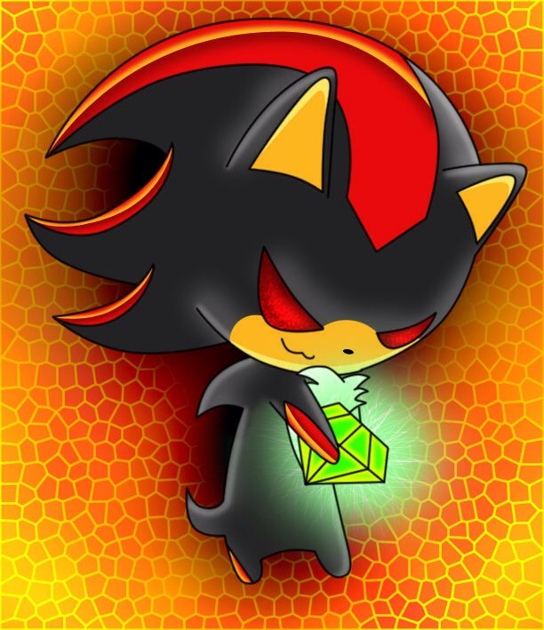
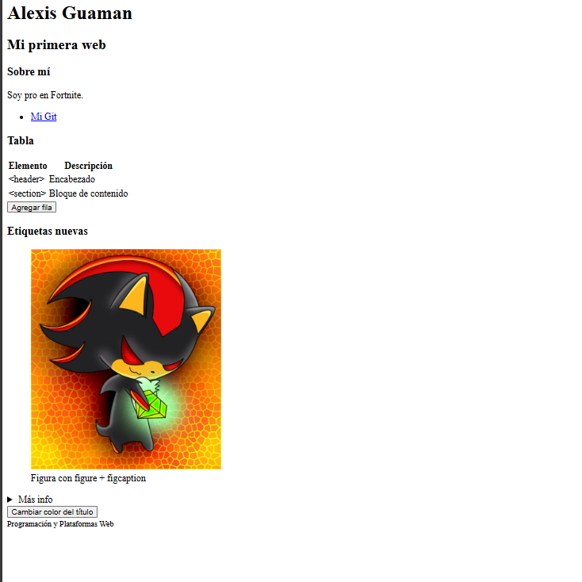
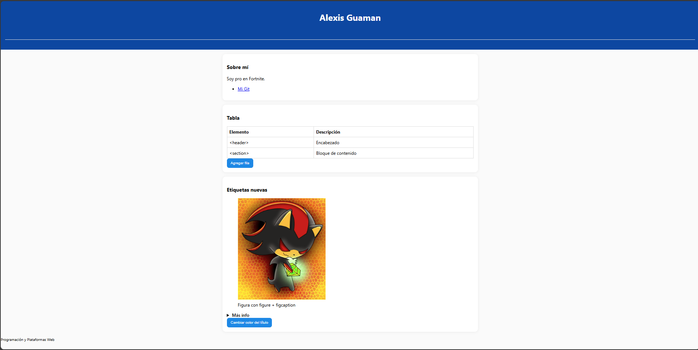

# Programación y Plataformas Web (PPW) 
## Prácticas 1 y 2 — Estándares Web con HTML, CSS y JavaScript

Este proyecto demuestra los conocimientos adquiridos en la asignatura de **Programación y Plataformas Web**, aplicando los estándares fundamentales del desarrollo frontend.

- **Asignatura:** Programación y Plataformas Web
- **Unidad:** 1.2 – Estándares Web
- **Estudiante:** Alexis Guaman
- **Repositorio:** [`kennypallchizaca-coder/icc-ppw-u1-miPrimeraPagina`](https://github.com/kennypallchizaca-coder/icc-ppw-u1-miPrimeraPagina)
- **GitHub Pages:** [Ver proyecto en vivo](https://kennypallchizaca-coder.github.io/icc-ppw-u1-miPrimeraPagina/)

---

## 🚀 Práctica 1 – Explorando los Estándares Web con HTML

En esta fase se construyó la estructura semántica del sitio web utilizando únicamente HTML5.

### Estructura HTML Utilizada

| Componente | Descripción | Implementación |
| :--- | :--- | :--- |
| `<!DOCTYPE html>` | Declaración estándar del documento como HTML5. | Línea 1 |
| `<html lang="es">` | Define el idioma del documento para mejorar la accesibilidad. | Español |
| `<header>` | Contenedor para el encabezado principal del sitio. | Contiene `<h1>` y `<h2>`. |
| `<section>` | Agrupa contenido relacionado temáticamente. | Secciones: “Sobre mí”, “Tabla”, etc. |
| `<table>` | Muestra los elementos estudiados en formato tabular. | `<thead>` + `<tbody>` con datos. |
| `<footer>` | Pie de página del documento. | Contiene información del curso. |

### Nuevas Etiquetas Exploradas

Se investigaron e implementaron etiquetas de HTML5 para enriquecer la semántica.

| Etiqueta | Descripción | Implementación |
| :--- | :--- | :--- |
| `<figure>` + `<figcaption>` | Permite asociar una imagen con una leyenda descriptiva. | Imagen de ejemplo con leyenda. |
| `<details>` + `<summary>` | Crea un bloque de contenido plegable de forma nativa. | Sección "Más info" que se expande. |

#### Fragmento de Ejemplo

```html
<figure>
  
  <figcaption>Figura creada con figure y figcaption</figcaption>
</figure>

<details>
  <summary>Más información</summary>
  <p>Este es un contenido ocultable que aparece al hacer clic.</p>
</details>
```

 ## Práctica 2 – Estilos con CSS e Interactividad con JavaScript
En la segunda fase se añadieron los archivos styles.css y script.js para mejorar la presentación y agregar comportamiento dinámico.

1. Estructura de Archivos
El proyecto quedó organizado de la siguiente manera:
icc-ppw-u1-miPrimeraPagina/
├── index.html
├── styles.css
├── script.js
├── ejemplo.png
└── README.md

2. Implementación de CSS y JS
Los archivos fueron enlazados en index.html de la siguiente forma:
CSS: Dentro de la etiqueta <head> para que los estilos se carguen primero.
<link rel="stylesheet" href="styles.css" />

JavaScript: Justo antes del cierre de la etiqueta </body> para asegurar que el DOM esté cargado antes de ejecutar los scripts.
<script src="script.js"></script>

3. Estilos Aplicados con CSS
Se aplicaron diversos estilos para mejorar la apariencia visual del sitio.

| Selector  | Estilo implementado                                                                 | Descripción                                           |
|:---------:|:------------------------------------------------------------------------------------:|:-----------------------------------------------------:|
| `body`    | `background-color`, `font-family`, `margin`                                         | Fondo claro, tipografía del sistema, sin margen base  |
| `header`  | `background-color`, `color`, `text-align`, `padding`                                | Encabezado azul, texto blanco, centrado, espaciado    |
| `h2`      | `color`, `border-bottom`, `padding-bottom`                                          | Subtítulo con línea inferior                          |
| `section` | `margin`, `padding`, `border-radius`, `box-shadow`, `background`                    | Tarjetas con relleno, esquinas redondeadas y sombra   |
| `table`   | `border-collapse`, `width`                                                          | Tabla de ancho completo y bordes unidos               |
| `th, td`  | `border`, `padding`, `text-align`                                                   | Celdas con borde y espaciado                          |
| `button`  | `background-color`, `color`, `border-radius`, `cursor`, `:hover`, `transition: background-color .2s ease-in-out;` | Botón primario con efecto hover y transición suave |
| `#logo`   | `filter: sepia(25%);`                                                               | Efecto sepia sobre la imagen                          |


Ejemplo de Código CSS
```css
button {
  background-color: #1e88e5;
  color: #fff;
  border: none;
  border-radius: 8px;
  padding: 10px 14px;
  cursor: pointer;
  transition: background-color 0.2s ease-in-out;
}

button:hover {
  background-color: #166eb3;
}

#logo {
  filter: sepia(25%);
}
```

4. Interactividad con JavaScript
Se implementaron tres funcionalidades dinámicas para interactuar con el DOM.

a) Agregar Fila a la Tabla
Añade un nuevo elemento a la tabla al hacer clic en un botón.

JavaScript

```javascript
document.getElementById('btn').addEventListener('click', () => {
  const tbody = document.querySelector('#tabla tbody');
  const tr = document.createElement('tr');
  tr.innerHTML = '<td>&lt;footer&gt;</td><td>Pie de página</td>';
  tbody.appendChild(tr);
  alert('Fila agregada correctamente');
});
```

b) Cambiar Color del Título con Botón
Modifica el color del <h1> de forma aleatoria a partir de una paleta predefinida.

JavaScript

```javascript
document.getElementById('btn1').onclick = () => {
  const h1 = document.querySelector('h1');
  const colores = ['#1e88e5', '#43a047', '#e53935', '#8e24aa'];
  const colorAleatorio = colores[Math.floor(Math.random() * colores.length)];
  h1.style.color = colorAleatorio;
};
```

c) Cambiar Color del Título al Pasar el Cursor
El <h1> cambia de color al pasar el ratón por encima y vuelve a su color original al quitarlo.

JavaScript

```javascript
const titulo = document.getElementById('titulo');
const colores = ['#1e88e5', '#43a047', '#e53935', '#8e24aa', '#ff6f00'];
let colorOriginal;

titulo.addEventListener('mouseenter', () => {
  colorOriginal = getComputedStyle(titulo).color;
  const colorAleatorio = colores[Math.floor(Math.random() * colores.length)];
  titulo.style.color = colorAleatorio;
});

titulo.addEventListener('mouseleave', () => {
  titulo.style.color = colorOriginal;
});
```

Capturas de Pantalla
